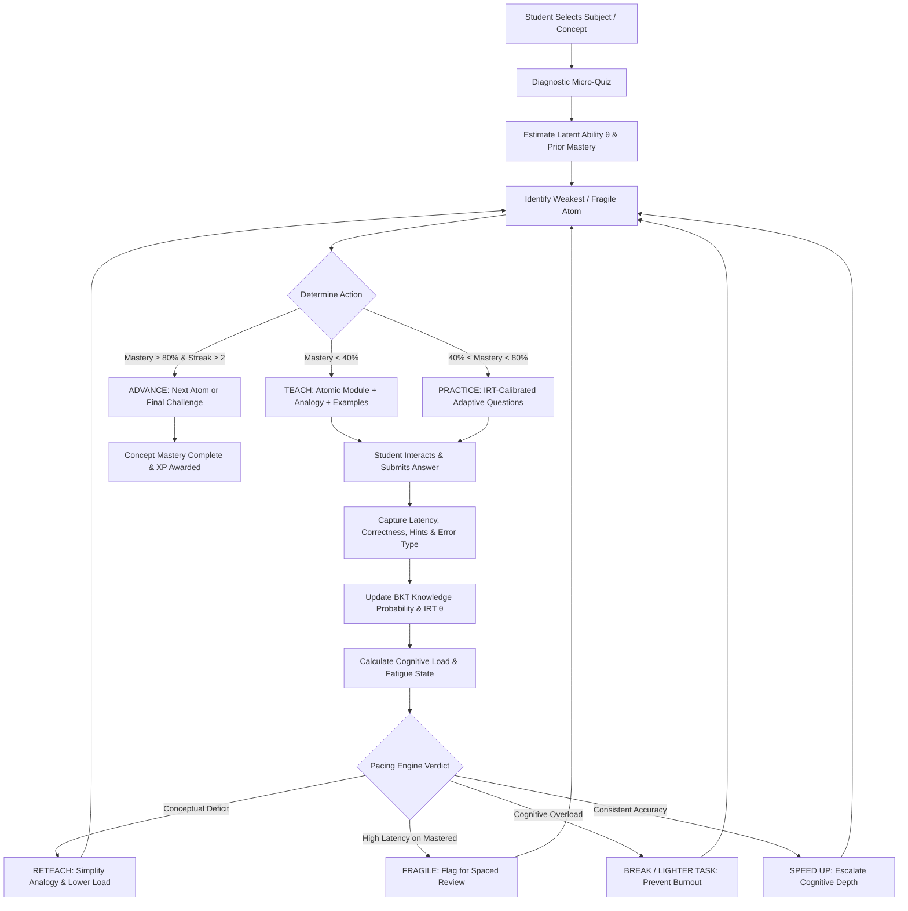
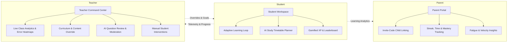
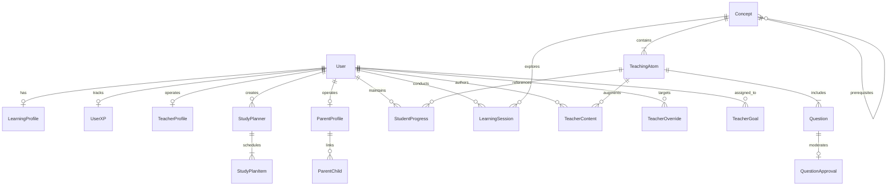

# AdaptiveLearning

### An AI teacher that adapts to the learner — not the other way around.

[](https://python.org)
[](https://djangoproject.com)
[](https://react.dev)
[](https://vitejs.dev)
[](https://groq.com)
[](https://ai.google.dev)


## 📖 Table of Contents

1. [The Problem: Why Traditional & Chatbot Models Fail](#-the-problem-why-traditional--chatbot-models-fail)
2. [The Core Idea: AI Teaches Differently](#-the-core-idea-ai-teaches-differently)
3. [Educational Reasoning & Cognitive Foundations](#-educational-reasoning--cognitive-foundations)
4. [The 10-Feature Adaptive Pacing Engine](#-the-10-feature-adaptive-pacing-engine)
5. [The Teaching-First Student Experience](#-the-teaching-first-student-experience)
6. [Multi-Stakeholder Ecosystem](#-multi-stakeholder-ecosystem)
7. [System Architecture & Tech Stack](#-system-architecture--tech-stack)
8. [Database Schema & Domain Models](#-database-schema--domain-models)
9. [API Reference](#-api-reference)
10. [Installation & Local Setup](#-installation--local-setup)
11. [Honest Technical Evaluation & Limitations](#-honest-technical-evaluation--limitations)

---

## 🚨 The Problem: Why Traditional & Chatbot Models Fail

### 1. The Conventional Classroom & Static E-Learning
Traditional education operates under a rigid, one-size-fits-all assumption:
* **Fixed Sequence:** Every student is forced through identical chapter sequences.
* **Uniform Explanations:** Explanations assume a uniform baseline understanding.
* **Static Question Sets:** Practice assignments do not adjust difficulty based on performance.
* **Rigid Pacing:** Fast learners become disengaged from lack of challenge, while struggling learners fall into compound deficits when missing foundational prerequisites.

### 2. The Flaw of "Chatbot Bolted to a Textbook"
Most recent AI-in-education tools simply slap a conversational LLM onto textbook PDFs:
* They are **passive** — waiting for students to ask questions, though students rarely know *what* they misunderstand.
* They lack **pedagogical memory** — unable to track latent ability or skill decay mathematically over time.
* They have no **cognitive load awareness** — generating walls of unstructured text that overwhelm working memory.
* They lack **curriculum steering** — incapable of verifying whether a foundational concept was mastered before advancing.

> **AdaptiveLearning replaces the passive chatbot with an active pedagogical control loop:** an autonomous teaching system that decomposes subjects into atomic learning units, runs continuous psychometric diagnostics, detects cognitive fatigue, and decides instructional moves algorithmically.

---

## 💡 The Core Idea: AI Teaches Differently

```
Traditional Model:
  Topic ──► Lesson ──► Quiz ──► Next Topic (Regardless of gaps)

AdaptiveLearning Model:
  Student Signal ──► Ability Estimation ──► Pedagogical Decision ──► Atomic Teaching ──► Targeted Practice ──► Re-estimation ──► Loop
```

### The Adaptive Closed-Loop Architecture



---

## 🧠 Educational Reasoning & Cognitive Foundations

AdaptiveLearning is built on validated cognitive science and psychometric measurement principles:

### 1. Cognitive Load Theory (Sweller) & Micro-Curriculum
* Working memory has strict capacity limits ($7 \pm 2$ chunks).
* **Implementation:** Complex subjects are partitioned into fine-grained **Teaching Atoms** (`TeachingAtom`). Each atom encapsulates exactly one distinct knowledge unit, explained with a dual-coding format (conceptual breakdown, real-world analogy, and concrete examples) before any questions are presented.

### 2. Item Response Theory (2PL IRT Model) & Latent Ability ($\theta$)
* Student ability is modeled as continuous parameter $\theta$, and item response probability is governed by item difficulty $b$ and discrimination $a$:
$$P(\text{correct} \mid \theta, a, b) = \frac{1}{1 + e^{-a(\theta - b)}}$$
* When answers are submitted, $\theta$ updates via gradient ascent on the log-likelihood function, dynamically calibrated with response latency and error type weights.

### 3. Bayesian Knowledge Tracing (BKT)
* Skill mastery probability $P(L_t)$ updates on every observation while accounting for slip ($P(S)$) and guess ($P(G)$) probabilities:
$$P(L_t \mid \text{correct}) = \frac{P(L_{t-1})(1 - P(S))}{P(L_{t-1})(1 - P(S)) + (1 - P(L_{t-1}))P(G)}$$
$$P(L_t) = P(L_t \mid \text{obs}) + (1 - P(L_t \mid \text{obs})) \cdot P(T)$$
* This ensures that lucky guesses don't falsely advance students, and careless slips don't ruin mastery.

### 4. 6-Class Error Typology
Errors are not treated equally. The engine classifies each incorrect submission into a distinct error category:
| Error Type | Detection Signal | Pedagogical Penalty | Engine Response |
| :--- | :--- | :--- | :--- |
| **Guessing** | Incorrect answer submitted in $< 50\%$ expected time | $-0.02$ (Low) | Reinforce question, disallow speed advancement |
| **Attentional** | Fast slip on an easy/familiar concept | $-0.03$ (Low) | Provide attention prompt |
| **Factual** | Incorrect on recall-oriented questions | $-0.06$ (Medium) | Highlight specific missing definitions |
| **Procedural** | Multi-step computation or logic failure | $-0.08$ (High) | Step-by-step scaffolding |
| **Conceptual** | Slow incorrect response on core easy/medium questions ($> 1.3\times$ time) | $-0.12$ (Severe) | Immediate analogy reframing & remedial reteach |
| **Structural** | Comparison/relationship failure between sub-concepts | $-0.10$ (Severe) | Relational mapping review |

### 5. Spaced Repetition & Fragile Knowledge Detection
* Knowledge decays according to the Ebbinghaus forgetting curve with an estimated half-life:
$$R(t) = e^{-\frac{\Delta t}{\tau}}$$
* **Fragile Knowledge Detection:** If a student previously mastered an atom ($\ge 80\%$) but later fails a review question or exhibits a latency spike ($> 2\times$ expected time), the atom state transitions from `complete` to `fragile`, applying an immediate $-0.15$ decay penalty and scheduling targeted reinforcement.

---

## ⚙️ The 10-Feature Adaptive Pacing Engine

The core decision system (`pacing_engine.py` and `adaptive_flow.py`) processes multidimensional learning telemetry on every turn:

```
                                  PACING ENGINE INPUTS
┌───────────────────────────┬───────────────────────────┬───────────────────────────┐
│ Performance Metrics       │ Behavioral Signals        │ Health & State Signals    │
├───────────────────────────┼───────────────────────────┼───────────────────────────┤
│ • Window Accuracy (0-1)   │ • Avg vs. Expected Time   │ • Fatigue Level (5-tier)  │
│ • BKT Mastery Score (0-1) │ • Hint Usage Ratio        │ • Session Duration        │
│ • Streak Count (±N)       │ • Consecutive Skips       │ • Retention Decay Score   │
│ • IRT Latent Ability (θ)  │ • Error-Type Distribution │ • Drop-Off Risk           │
└───────────────────────────┴───────────────────────────┴───────────────────────────┘
                                         │
                                         ▼
                               [ PacingEngine.decide_pacing ]
                                         │
                                         ▼
                                  PACING DECISIONS
┌───────────────────────┬───────────────────────┬───────────────────────────────────┐
│ Speed Decision        │ Next Action           │ System Adaptations                │
├───────────────────────┼───────────────────────┼───────────────────────────────────┤
│ • speed_up            │ • advance_next_atom   │ • Recommended difficulty (E/M/H)  │
│ • stay                │ • continue_practice   │ • Mastery verdict                 │
│ • slow_down           │ • reteach             │ • Retention review scheduling     │
│ • sharp_slowdown      │ • take_break          │ • Hint dependency warnings        │
│                       │ • lighter_task        │ • Velocity snapshot telemetry     │
└───────────────────────┴───────────────────────┴───────────────────────────────────┘
```

1. **Diagnostic Micro-Quiz Baseline:** Calibrates starting ability band (`easy`, `medium`, `hard`) and pace (`fast`, `normal`, `slow`, `very_slow`) before entering a concept.
2. **Per-Atom Learning Speed Tracking:** Measures response time per question against calibrated cognitive operation baselines (`recall`: 45s, `apply`: 60s, `analyze`: 90s).
3. **Weighted Error-Type Analysis:** Adjusts learning rates dynamically so conceptual failures trigger heavier remediation than accidental slips.
4. **Adaptive Pacing Rules:** Threshold-driven pace transitions conditioned on learner level (`zero`, `beginner`, `intermediate`, `advanced`).
5. **Dynamic Mastery Exit Thresholds:** Enforces multi-gate exit criteria (mastery $\ge 80\%$, streak $\ge 2$, minimum 3–5 questions answered) to prevent premature progression.
6. **Retention Checks & Half-Life Decay:** Proactively calculates decay over inactive periods and queues spaced reviews.
7. **Adaptive Hint Depth & Dependency Monitoring:** Warns when hint dependency ratio exceeds $50\%$, preventing false mastery illusions.
8. **Multi-Factor Fatigue Detection:** Classifies student fatigue into `fresh`, `mild`, `moderate`, `high`, `critical` using session length, total questions, and accuracy degradation.
9. **Engagement & Drop-off Risk Assessment:** Monitors consecutive question skips and response time anomalies to suggest lighter exploratory tasks or breaks.
10. **Learning Velocity Telemetry:** Tracks real-time velocity ($V = \frac{\text{Atoms Mastered}}{\text{Time Spent}}$) rendered as live sparkline analytics.

---

## 🖥️ The Teaching-First Student Experience

```
[ Concept Selection ] ──► [ Concept Overview Map ] ──► [ Diagnostic Micro-Quiz ]
                                                                 │
┌────────────────────────────────────────────────────────────────┘
▼
[ 1. Teaching Module ]
  • Structured explanation of the single active atom
  • Teacher-curated notes & examples (if overridden by educator)
  • Intuitive real-world analogy
  • Embedded multi-modal search (YouTube tutorials + SerpAPI diagrams)
  • Interactive AI Doubt Assistant (answers contextual questions on this atom)
        │
        ▼
[ 2. Targeted Practice Drills ]
  • Dynamic question generation matching current θ difficulty
  • Cognitive operation tagging (Recall / Apply / Analyze)
  • Progressive tiered hints with usage tracking
  • Millisecond-precision timer capturing latency
        │
        ▼
[ 3. Instant Mastery & Diagnostic Feedback ]
  • Real-time mastery bar updates & IRT θ movement
  • Error classification feedback (explains *why* the misconception occurred)
  • Dynamic Next Action: Reteach, Continue Practice, or Advance
        │
        ▼
[ 4. Atom Summary & Mastery Milestone ]
  • Key takeaways synthesized
  • XP awarded to user profile
        │
        ▼
[ 5. Concept Final Challenge ]
  • Comprehensive assessment covering all concept atoms
  • Weak Topic Detector: surfaces lagging atoms for instant remediation
```

---

## 👥 Multi-Stakeholder Ecosystem

AdaptiveLearning is not an isolated tutor; it connects the three key stakeholders in modern education:



### 1. Teacher Command Center
* **Class Analytics:** Class-wide mastery distributions, average learning velocity, and aggregate error-type breakdown.
* **Student Drill-Down:** Per-student psychometric ability ($\theta$), progress history, and fatigue logs.
* **Curriculum & Content Management:** Teachers can author custom explanations, analogies, and tips for any atom. When published, teacher content takes precedence over AI-generated teaching.
* **AI Question Moderation:** Review, edit, approve, or disable AI-generated practice questions.
* **Direct Interventions (Overrides):** Reset mastery, force immediate reviews, set target mastery thresholds, or assign remedial content.
* **Goal Setting:** Assign class-wide or individual milestone deadlines with target mastery goals.

### 2. Parent Portal
* **Simple Linking:** Parents link to their child's account via a secure, single-use invite code.
* **Holistic Visibility:** View learning streaks, total time spent, concept mastery percentages, and recent fatigue events without micromanagement.
* **Actionable Guidance:** Provides parents with non-technical summaries of what their child mastered and where encouragement is needed.

### 3. AI Study Planner
* Generates structured weekly study plans (Mon–Fri or Mon–Sun) customized to student goals (`regular study`, `exam preparation`) and available daily hours.
* Daily study views (`/api/today-study/`) allow students to check off assigned topics and track goal compliance.

---

## 🏗️ System Architecture & Tech Stack

```
AdaptiveLearning/
├── backend/                  # Django REST API & Adaptive Engine
│   ├── accounts/             # Auth, User Profiles, DB Models, Serializers, Views
│   │   ├── models.py         # Complete domain data models (Student, Teacher, Parent, Planner)
│   │   ├── views.py          # REST endpoints for teaching, analytics, overrides, auth
│   │   ├── serializers.py    # DRF serializers
│   │   ├── subject_data.py   # Seed curriculum & fallback knowledge base
│   │   └── urls.py           # API route declarations
│   ├── learning_engine/      # Core Psychometrics & AI Orchestration
│   │   ├── adaptive_flow.py  # AdaptiveLearningEngine main brain (atom selection & loop)
│   │   ├── pacing_engine.py  # 10-feature PacingEngine & context evaluation
│   │   ├── knowledge_tracing.py # BKT updates, 2PL IRT theta calculation, error classifier
│   │   ├── cognitive_load.py # Real-time cognitive load & session shaping
│   │   ├── question_generator.py # Groq LLaMA 3.3 & Gemini 2.5 Flash question pipeline
│   │   ├── external_resources.py # SerpAPI diagram fetcher & YouTube search
│   │   ├── ai_study_planner.py   # Gemini-powered timetable generator
│   │   └── ai_assistant.py       # Contextual doubt solving assistant
│   └── manage.py
│
└── frontend/                 # React 19 + Vite Single Page App
    └── src/
        ├── components/
        │   ├── Learning/     # Teaching-first adaptive learning loop
        │   │   ├── TeachingFirstFlow.jsx    # Core interactive state machine
        │   │   ├── TeachingModule.jsx       # Atom lesson viewer + resources + AI doubt
        │   │   ├── QuestionsFromTeaching.jsx# Question runner with timer & hints
        │   │   ├── FatigueIndicator.jsx     # Break & load alerts
        │   │   ├── LearningVelocityGraph.jsx# Real-time velocity telemetry
        │   │   ├── WeakTopicDetector.jsx    # Post-challenge weakness locator
        │   │   └── ExternalResources.jsx    # YouTube tutorials & diagram viewer
        │   ├── Teacher/      # Teacher portal (analytics, content, overrides, questions)
        │   ├── Parent/       # Parent portal (child linking, progress insights)
        │   ├── Planner/      # AI study timetable planner
        │   ├── Dashboard.jsx # Student hub with streak, active concepts & analytics
        │   └── Leaderboard.jsx# Gamified XP ranking
        ├── context/          # LearningContext & Auth state management
        └── axiosConfig.js    # JWT-intercepted API client
```

### Technology Matrix
| Layer | Technologies | Purpose |
| :--- | :--- | :--- |
| **Backend Framework** | Python 3.11+, Django 6.0, Django REST Framework | REST APIs, business logic, ORM |
| **Authentication** | `djangorestframework-simplejwt` | Token-based JWT auth for Student, Teacher, Parent |
| **AI / LLM Providers** | **Groq** (`llama-3.3-70b-versatile`), **Google Gemini** (`gemini-2.5-flash`, `gemini-2.0-flash`) | Sub-concept generation, question authoring, analogies, AI doubt solver, study planner |
| **External Search** | SerpAPI (`google_images`), `youtube-search` | Educational diagrams and video tutorials |
| **Frontend Framework** | React 19.2, Vite 8.0, React Router v7 | Responsive SPA client |
| **Styling & UI** | Tailwind CSS, Lucide React, Custom Glassmorphic Theme | Modern interface design system |
| **State Management** | React Context API (`LearningContext`, `AuthContext`) | Global state for active sessions, telemetry, and metrics |

---

## 🗄️ Database Schema & Domain Models



### Key Models Reference
* **`LearningProfile`**: Persistent student psychometrics (`overall_theta`, `learning_streak`, `total_time_spent`, `current_concept`).
* **`Concept` & `TeachingAtom`**: Hierarchical knowledge graph. Atoms belong to concepts and maintain discrete ordering, analogies, and explanations.
* **`Question`**: Assessment bank items with difficulty levels (`easy`, `medium`, `hard`), cognitive operations (`recall`, `apply`, `analyze`), estimated times, options, and correct answers.
* **`StudentProgress`**: Granular per-atom state tracking (`mastery_score`, `phase`, `streak`, `hint_usage`, `error_history`, `time_per_question`, `retention_score`, `velocity_snapshots`).
* **`LearningSession`**: Session-level telemetry (`fatigue_level`, `break_count`, `engagement_score`, `consecutive_skips`, `velocity_data`).
* **`TeacherContent` & `QuestionApproval`**: Educator oversight models for prioritizing custom lessons over AI and approving generated questions.
* **`TeacherOverride` & `TeacherGoal`**: Direct educational interventions and deadline-driven mastery targets.
* **`ParentChild`**: Many-to-one family relationships managed via secure invite tokens.
* **`StudyPlanner` & `StudyPlanItem`**: AI-generated structured daily timetables.

---

## 🔌 API Reference

### 1. Adaptive Learning & Teaching Flow
| Method | Endpoint | Description |
| :--- | :--- | :--- |
| `POST` | `/api/start-teaching-session/` | Initializes learning session and selects starting atom |
| `POST` | `/api/initial-quiz/` | Generates diagnostic micro-quiz questions |
| `POST` | `/api/submit-initial-quiz-answer/` | Records diagnostic answer and updates preliminary theta |
| `POST` | `/api/complete-initial-quiz/` | Evaluates full diagnostic, seeds mastery, and sets pacing band |
| `GET` | `/api/teaching-content/` | Fetches active atom explanation, analogy, examples, and resources |
| `POST` | `/api/generate-questions-from-teaching/` | Generates/retrieves targeted questions for current atom |
| `POST` | `/api/submit-atom-answer/` | Submits answer, runs BKT/IRT update, classifies error, and updates pacing |
| `POST` | `/api/complete-atom/` | Finalizes atom mastery, awards XP, and updates streak |
| `GET` | `/api/next-learning-step/` | **Engine Brain:** Selects weakest/fragile atom and returns next action (`TEACH`/`PRACTICE`/`ADVANCE`) |
| `GET` | `/api/concept-overview/` | Fetches high-level concept overview and atom dependency map |
| `POST` | `/api/adaptive-reteach/` | Triggers simplified remediation for struggling atoms |
| `GET` | `/api/all-atoms-mastery/` | Aggregates mastery status across all atoms in a concept |
| `POST` | `/api/concept-final-challenge/` | Generates cross-atom final evaluation challenge |
| `POST` | `/api/complete-concept-final-challenge/` | Finalizes concept, triggers weak-topic analysis |

### 2. Telemetry, Psychometrics & Pacing
| Method | Endpoint | Description |
| :--- | :--- | :--- |
| `GET` | `/api/velocity-graph/` | Point-in-time learning velocity data points |
| `GET` | `/api/fatigue-status/` | Real-time fatigue assessment and recommended rest actions |
| `POST` | `/api/record-break/` | Logs student rest period, resetting cognitive fatigue counters |
| `POST` | `/api/retention-check/` | Evaluates retention decay and triggers review questions |
| `POST` | `/api/record-hint/` | Logs hint request and updates hint dependency ratio |
| `POST` | `/ai-assistant/` | Context-aware AI tutor for immediate doubt resolution |
| `GET` | `/api/concept-resources/` | External YouTube videos and SerpAPI diagram links |

### 3. Teacher Management & Analytics
| Method | Endpoint | Description |
| :--- | :--- | :--- |
| `GET` | `/api/teacher/class-analytics/` | Class-level performance, error distributions, and velocity trends |
| `GET` | `/api/teacher/students/` | Complete student roster with mastery levels |
| `GET` | `/api/teacher/student-detail/` | Individual student deep-dive telemetry and history |
| `POST` | `/api/teacher/content/` | Authors custom teacher explanations and analogies |
| `POST` | `/api/teacher/question-approve/` | Approves, edits, or rejects AI-generated questions |
| `POST` | `/api/teacher/overrides/` | Applies direct pedagogical intervention to a student |
| `POST` | `/api/teacher/goals/` | Sets mastery target deadlines for individuals or entire class |

### 4. Parent & Study Planner
| Method | Endpoint | Description |
| :--- | :--- | :--- |
| `GET` | `/api/parent/children/` | Lists linked children profiles |
| `POST` | `/api/parent/link-child/` | Links child profile using invite code |
| `GET` | `/api/parent/child/<id>/insights/` | Child mastery overview, study streaks, and alerts |
| `POST` | `/create-planner/` | Generates AI study timetable |
| `GET` | `/my-planner/` | Retrieves current active study timetable |
| `GET` | `/today-study/` | Today's scheduled study items and check-off status |

---

## 🚀 Installation & Local Setup

### Prerequisites
* **Python 3.11+**
* **Node.js 18+ & npm**
* **API Keys (Optional but Recommended):**
  * `GROQ_API_KEY` (for ultra-fast LLaMA 3.3 question generation)
  * `GOOGLE_API_KEY` (for Gemini atom generation and study planning)
  * `SERPAPI_KEY` (for live educational diagrams)

> **Note on Fallbacks:** The system includes comprehensive pre-seeded fallback curriculum data and deterministic heuristic algorithms (`subject_data.py`). If API keys are omitted, the full adaptive learning loop remains fully functional using local curriculum templates.

---

### Backend Setup

1. **Navigate to the backend folder:**
   ```bash
   cd backend
   ```

2. **Create and activate a virtual environment:**
   ```bash
   # On Windows:
   python -m venv venv
   .\venv\Scripts\activate

   # On macOS/Linux:
   python3 -m venv venv
   source venv/bin/activate
   ```

3. **Install dependencies:**
   ```bash
   pip install -r requirements.txt
   ```

4. **Configure environment variables:**
   Create a `.env` file in the `backend/` root:
   ```env
   SECRET_KEY=your-django-secret-key
   DEBUG=True
   GROQ_API_KEY=your_groq_api_key
   GOOGLE_API_KEY=your_gemini_api_key
   SERPAPI_KEY=your_serpapi_key
   ```

5. **Apply database migrations:**
   ```bash
   python manage.py migrate
   ```

6. **Start the Django development server:**
   ```bash
   python manage.py runserver
   ```
   *Backend runs at `http://127.0.0.1:8000/`.*

---

### Frontend Setup

1. **Navigate to the frontend folder:**
   ```bash
   cd frontend
   ```

2. **Install dependencies:**
   ```bash
   npm install
   ```

3. **Start the Vite development server:**
   ```bash
   npm run dev
   ```
   *Frontend opens at `http://localhost:5173/`.*

---

## 🔍 Honest Technical Evaluation & Limitations

In accordance with strict hackathon evaluation standards, here is an authentic appraisal of the current implementation:

### What Is Fully Functional & Working
* ✅ **Complete Teaching-First Loop:** The end-to-end interactive flow (`Concept Overview` $\rightarrow$ `Diagnostic` $\rightarrow$ `Teaching Atom` $\rightarrow$ `Adaptive Questions` $\rightarrow$ `Mastery Update` $\rightarrow$ `Final Challenge`) is fully built and connected.
* ✅ **Psychometric Algorithms:** 2PL Item Response Theory ($\theta$), Bayesian Knowledge Tracing updates, and 6-class error categorization run in real time on every answer submission.
* ✅ **10-Feature Pacing Engine:** Multi-factor fatigue detection, hint dependency warnings, dynamic exit thresholds, and learning speed evaluation operate directly in the backend.
* ✅ **Multi-Portal Architecture:** Dedicated dashboards and API permissions exist for Students, Teachers (with full intervention tools), and Parents (with invite-code linking).
* ✅ **Resilient Fallback Design:** If external LLM APIs experience rate limits, the system seamlessly falls back to pre-seeded curriculum units and rule-based generators without crashing.

### Current Limitations & Future Roadmap
* ⚠️ **Database:** Currently configured for development with SQLite. For high-concurrency production deployments with thousands of concurrent learners, migration to PostgreSQL with connection pooling is planned.
* ⚠️ **Spaced Retention Acceleration:** In the hackathon prototype, retention decay calculations are accelerated to allow testing of review mechanisms within short evaluation sessions rather than requiring weeks of real-time latency.
* ⚠️ **LLM Generation Latency:** While Groq inference is near-instantaneous (~300ms), cold-start fallback generation on complex concepts can take 2–3 seconds. Client-side optimistic loading states are used to maintain responsiveness.
* ⚠️ **Open-Response Grading:** The current assessment engine focuses on dynamically calibrated multiple-choice and multi-step cognitive questions. Fine-grained semantic grading of free-text essay answers is scheduled for the next release.

